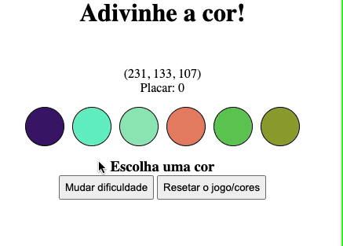

Nesse projeto utilizei JavaScript, HTML5 e CSS3.

O objetivo princial desse projeto foi criar um joguinho de adivinhação.

 

  

 

Foi criado um adivinhador de cor RGB, ou seja, dada uma string RGB, serão fornecidos 6 alternativas visuais de cores, sendo uma delas a correspondente ao valor em RGB. Cada acerto irá gerar pontos pro usuário, sendo atualizado o seu placar.

 

Aplicação on-line <a href='https://ilanaragao.github.io/projects/color-guess/' target='_blank'>aqui</a>.

