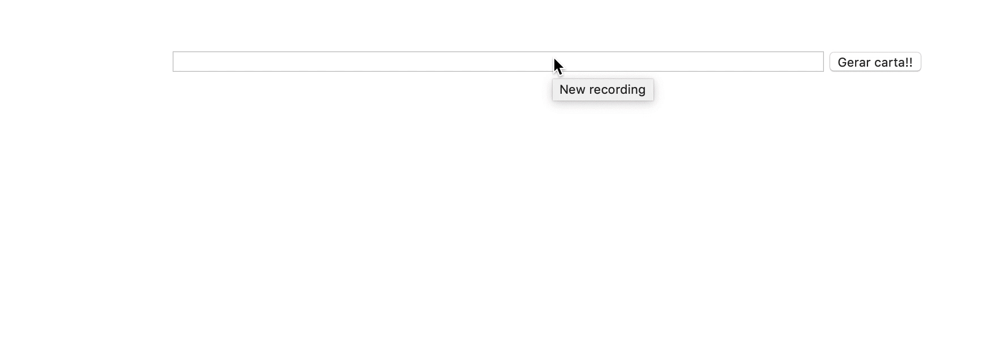

## Habilidades

- Manipulei o _DOM_.
- Utilizei _JavaScript_.
- Utilizei _CSS3_.

## Objetivo

O objetivo princial desse projeto era desenvolver um site que gere cartas misteriosas.

 

  

 

 

Aplicação on-line <a href='https://ilanaragao.github.io/projects/mistery-letter/' target='_blank'>aqui</a>.

